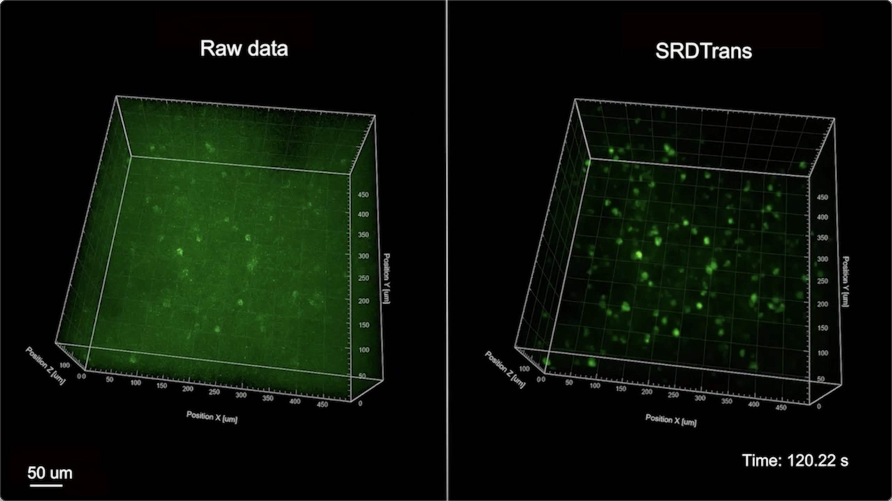
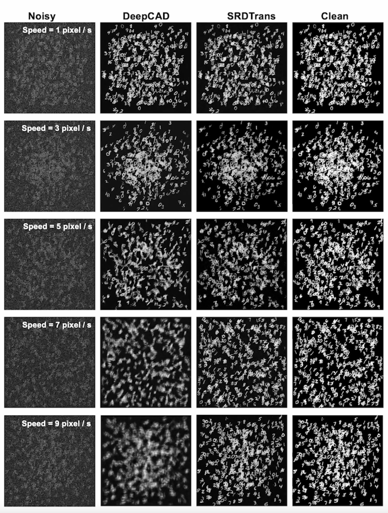

# Spatial redundancy transformer for self-supervised fluorescence image denoising

<p align="center">
  
</p> 

## <div align="center"><b><a href="README.md">SRDTrans</a></b></div>

<div align="center">

✨ [**Method**](#-Method) **|** 🚩 [**Paper**](#-Paper) **|** 🔧 [**Install**](#-Install)  **|** 🎨 [**Data preparation**](#-Data-preparation)  **|** 💻 [**Train**](#-Train) **|** 🏰 [**Model Zoo**](#-Model-Zoo)**|** ⚡ [**Usage**](#-Quick-Inference)**|** &#x1F308; [**Demo**](#-Demo)


</div>

---


## ✨ Method

<p align="center">

</p>

-  We provide a spatial redundancy denoising transformer (SRDTrans) to remove noise from fluorescence time-lapse images in a self-supervised manner. First, a sampling strategy based on spatial redundancy is proposed to extract adjacent orthogonal training pairs, which eliminates the dependence on high imaging speed. SRDTrans is complementary to our previously proposed [DeepCAD](https://www.nature.com/articles/s41592-021-01225-0) and [DeepCAD-RT](https://www.nature.com/articles/s41587-022-01450-8). Secondly, to break the performance bottleneck of convolutional neural networks (CNNs), we designed a lightweight spatiotemporal transformer architecture to capture long-range dependencies and high-resolution features at a low computational cost. SRDTrans can overcome the inherent spectral bias of CNNs and restore high-frequency information without producing over-smoothed structures and distorted fluorescence traces. Finally, we demonstrate the state-of-the-art denoising performance of SRDTrans on single-molecule localization microscopy and two-photon volumetric calcium imaging. SRDTrans does not contain any assumptions about the imaging process and the sample, thus can be easily extended to a wide range of imaging modalities and biological applications.


## 🚩 Paper

This repository is for SRDTrans introduced in the following paper

"Spatial redundancy transformer for self-supervised fluorescence image denoising" [[biorRXiv]](https://www.biorxiv.org/content/10.1101/2023.06.01.543361v1) 


## 🔧 Install

### Dependencies 
  - Python >= 3.6 
  - PyTorch >= 1.7 
    
### Installation

1. Clone the repository and delete placeholder files.

    ```bash
    git clone https://github.com/cabooster/SRDTrans.git
    cd SRDTrans
    rm datasets/clean/__init__.py datasets/noisy/__init__.py pth/__init__.py log/__init__.py
    ```

1. Install dependent packages

    ```bash
    $ conda create -n srdtrans python=3.6
    $ conda activate srdtrans
    $ pip install -r requirements.txt
    ```

## 🎨 Data preparation

| Data&nbsp;&nbsp;&nbsp;&nbsp;&nbsp;&nbsp;&nbsp;&nbsp;&nbsp;&nbsp;&nbsp;&nbsp;| Pixel&nbsp;size&nbsp;&nbsp;&nbsp;&nbsp;&nbsp;| Frame rate&nbsp;&nbsp;&nbsp;&nbsp;&nbsp;&nbsp;| Size&nbsp;&nbsp;&nbsp;&nbsp;&nbsp;&nbsp;   |Download |         Description                       |
| ---------------------------------------------- |:--------- | :---- | :---- | :---- | :------------------------------------------- |
|Calcium imaging |1.02 μm|30 Hz| 29.2 G   |  [Zenodo](https://doi.org/10.5281/zenodo.7812603)     |   Simulated calcium imaging data under different SNR      |
|Calcium imaging| 1.02 μm|0.1 Hz, 0.3Hz, 1 Hz, 3 Hz, 10 Hz, and 30 Hz|5.8 G   |  [Zenodo](https://doi.org/10.5281/zenodo.7812545)     |    SRDTrans dataset: simulated calcium imaging data at different imaging speeds|
|SMLM                    |30 nm |200 Hz|  48.0 G     |    [Zenodo](https://doi.org/10.5281/zenodo.7812590)    |    SRDTrans dataset: simulated SMLM data under different SNR|
|SMLM                    | 43 nm|200 Hz|  23.6 G     |    [Zenodo](https://doi.org/10.5281/zenodo.7813185)    |      SRDTrans dataset: experimental imaging SMLM data|


Download the demo data(.tif file) and put it into SRDTrans/datasets/.

## 💻 Train 

1. Data preparation 

Please delete the "_\_init__.py" file used for occupancy. Then, you can download the demo data(.tif file) and put the noisy data into datasets/noisy/.

2. Train

  ```bash
    # Simulated SMLM & Simulated Calcium imaging data at 30hz
    python -u train.py --datasets_folder noisy --datasets_path datasets/ --n_epochs 30 --GPU 0 --train_datasets_size 6000  --patch_x 128 --patch_t 128 
    # Simulated Calcium imaging data at 0.3hz
    python -u train.py --datasets_folder noisy --datasets_path datasets/ --n_epochs 30 --GPU 0 --train_datasets_size 3000  --patch_x 128 --patch_t 128 
  ```


## 🏰 Model Zoo
| Models                            | Modality  |Download                                  |
| --------------------------------- |:--------- | :------------------------------------------- |
| SRDTrans                 | Calcium imaging  |  [Zenodo](https://doi.org/10.5281/zenodo.7818031)                                              |
| SRDTrans                    | SMLM     |    [Zenodo](https://doi.org/10.5281/zenodo.7817710)   

## ⚡ Quick Inference
1. Pretrained model

    Download the pretrained model

2. Data preparation 

    Please delete the "_\_init__.py" file used for occupancy. Then, you can download the demo data(.tif file) and put the clean data into datasets/clean/.

3. Test

  ```bash
    # Simulated Calcium imaging dataat 0.3hz
    python -u test.py --denoise_model cad_03hz --patch_x 128 --patch_t 128 --GPU 0 --ckp_idx [test_idx] --datasets_folder noisy --test_datasize 1000 --datasets_path datasets/ --clean_path datasets/clean/clean.tif
  ```

---
## &#x1F308; Demo

  ### 1. SMLM denoising
  <p align="center">
  
  </p>

  ### 2. Localization and reconstruction of SMLM
  <p align="center">
  
  </p>

  ### 3. Calcium imaging denoising at 30 Hz
  <p align="center">
  
  </p>

  ### 4. Calcium imaging denoising at 0.3 Hz
  <p align="center">
  
  </p>

  ### 4. Videos
  You can click on the pictures to play the videos.
  1. SRDTrans enhances large-scale volumetric calcium imaging in the mouse cortex.

  [](https://youtu.be/0IUB8IRyIAM "Please click")

  2. The denoising performance of different methods on calcium imaging data sampled at 0.3 Hz.

  [](https://youtu.be/4p7y57EMY14 "Please click")
  3. Comparing the performance of DeepCAD and SRDTrans on fast-moving objects. 

  [](https://youtu.be/UpTXmd35Xxs "Please click")

[def]: #-demos-videos
